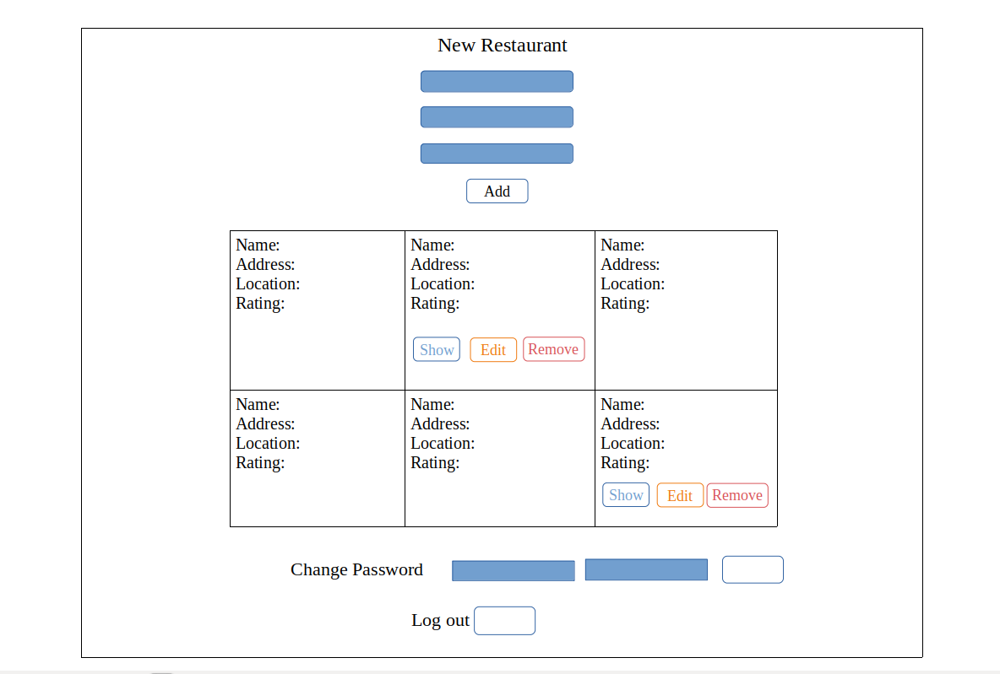

# My Dining List

`My Dining List` is my first full stack project. The project idea was sparked by my interest in the culinary world and previous experience in customer service.
The application allows users to create its own list of restaurants and add a short description, location and rating to each place. The app requires basic user authorization with email and password. The authorized user can see its own restaurants along with the restaurants created by other users. Every user has permission to update and delete restaurants from its own list.
The app is built as a SPA that means all interactions with users occur by rewriting the current page instead of reloading new one from the server.
The back-end of the application is built on Rails framework and deployed to heroku platform. The API is designed by implementing a RESTful architecture. The communication between client and server occurs by HTTP requests.

## Important links

* `My Dining List` API repo: https://github.com/tinatimkova/restaurants-rails-api
* `My Dining List`client deployed: https://tinatimkova.github.io/restaurants-client/
* `My Dining List` API deployed: https://radiant-meadow-15877.herokuapp.com/

## List of technologies used
1. JavaScript
2. NPM
3. Grunt
4. JQuery library
5. JSON with Ajax
6. HTML, DOM
7. CSS, Bootstrap framework
8. cURL

## Wireframes and user stories

### User stories
1. As a user, I would like to be able to sign up and sign in using email and a password.
2. As a user, I want to view all restaurants.
3. As a user, I want to view a single restaurant.
4. As a user, I want to be able to create a restaurant with a name, address, description and rating.
5. As a user, I want to edit a restaurant’s name, address, description and rating.
6. As a user, I want to delete a restaurant.
7. As a user, I want to be able to change a password.
8. As a user, I want to be able to log out.

### Wireframes

## Planning

When working on the project I followed the plan described below:
* write user stories
* draw wireframes
* draw ERD
* set up development environment
* create project API
* develop front-end
* add styling
* write documentation

## Development process and problem solving

I started the development process with completing project modeling lab (https://git.generalassemb.ly/timosha/full-stack-project-modeling-lab) and reviewing project requirements.
After setting up rails api and browser templates I developed back-end of the application. I scaffolded the restaurant resource, tested the end points with curl scripts. The restaurant controller inherits from OpenRead controller that allows index and show methods to be applied without authorization. I reviewed material from recent class sessions to be able to set relationship between user and restaurant resources. The resources have one-to-many relationship where user has many restaurants and restaurant belongs to a user (see ).
When done with rails API I switched to the front-end. User authentication part wasn't time-consuming since it's been implemented in my previous project as well. I wrote CRUD on restaurant resource and tested each request with curl. Through ajax technology the client sends and retrieves data from the api. When worked on UI I used handlebars template to display the list of all restaurants sending back from the database.

## List of unsolved problems

1. Create a form with user profile details
2. Add a table to display user's favorite restaurants
3. Replace number rating scale with star rating
4. Change `show`, `edit` and `remove` buttons design
